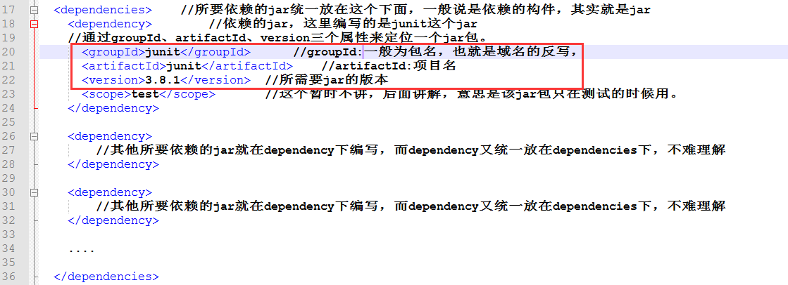
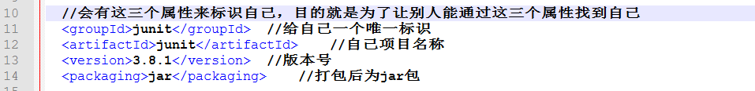
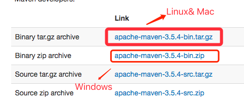

# Maven

## 1. Maven到底是什么

- Maven 翻译为"专家"、"内行"，是 Apache 下的一个纯 Java 开发的开源项目。基于项目对象模型（缩写：POM）概念，Maven利用一个中央信息片断能管理一个项目的构建、报告和文档等步骤。

- Maven 是一个项目管理工具，可以对 Java 项目进行构建、依赖管理。

- Maven 也可被用于构建和管理各种项目，例如 C#，Ruby，Scala 和其他语言编写的项目。Maven 曾是 Jakarta 项目的子项目，现为由 Apache 软件基金会主持的独立 Apache 项目。

上面说了这么多，那么maven到底是什么呢？ 我自己觉得，Maven的核心功能便是合理叙述项目间的依赖关系，通俗点讲，就是通过pom.xml文件的配置获取jar包，而不用手动去添加jar包。

怎么通过pom.xml的配置就可以获取到jar包呢？pom.xml配置文件从何而来？等等类似问题我们需要搞清楚，如果需要使用pom.xml来获取jar包，那么首先该项目就必须为maven项目，maven项目可以这样去想，就是在java项目和web项目的上面包裹了一层maven，本质上java项目还是java项目，web项目还是web项目，但是包裹了maven之后，就可以使用maven提供的一些功能了(通过pom.xml添加jar包)。

所以，根据上一段的描述，我们最终的目的就是学会如何在pom.xml中配置获取到我们想要的jar包，在此之前我们就必须了解如何创建maven项目，maven项目的结构是怎样，与普通java,web项目的区别在哪里，还有如何配置pom.xml获取到对应的jar包等等，这里提前了解一下我们如何通过pom.xml文件获取到想要的jar的，具体后面会详细讲解该配置文件。

pom.xml获取junit的jar包的编写:



为什么通过groupId、artifactId、version三个属性就能定位一个jar包？

假如上面的pom.xml文件属于A项目，那么A项目肯定是一个maven项目，通过上面这三个属性能够找到junit对应版本的jar包，那么junit项目肯定也是一个maven项目，junit的maven项目中的pom.xml文件就会有三个标识符，比如像下图这样，然后别的maven项目就能通过这三个属性来找到junit项目的jar包了。所以，在每个创建的maven项目时都会要求写上这三个属性值的。



## 2. Maven环境配置

Maven 是一个基于 Java 的工具，所以要做的第一件事情就是安装 JDK。
如果你还未安装 JDK，请去查看java开发环境配置相关文档。

**系统要求**
> Maven 3.3 要求 JDK 1.7 或以上

> Maven 3.2 要求 JDK 1.6 或以上

> Maven 3.0/3.1 要求 JDK 1.5 或以上

**Maven 下载**

Maven 下载地址：<http://maven.apache.org/download.cgi>



下载包后解压到对应目录(存储位置可根据自己情况配置)

**设置 Maven 环境变量**

打开terminel输入以下命令：

`vim ~/.bash_profile` 打开.bash_profile文件，在次文件中添加设置环境变量的命令

```
export MAVEN_HOME=/Users/lixiang/Maven/apache-maven-3.6.0
export PATH=${PATH}:${MAVEN_HOME}/bin
```

添加之后保存并推出，执行以下命令使配置生效：

`source ~/.bash_profile`

输入：mvn -v命令，查看配置是否生效，如果输入版本相关信息表示配置成功：

```
Apache Maven 3.6.0 (97c98ec64a1fdfee7767ce5ffb20918da4f719f3; 2018-10-25T02:41:47+08:00)
Maven home: /Users/lixiang/Maven/apache-maven-3.6.0
Java version: 1.8.0_202, vendor: Oracle Corporation, runtime: /Library/Java/JavaVirtualMachines/jdk1.8.0_202.jdk/Contents/Home/jre
Default locale: zh_CN, platform encoding: UTF-8
OS name: "mac os x", version: "10.14.3", arch: "x86_64", family: "mac"
```

## 3. 仓库的概念

通过pom.xml中的配置，就能够获取到想要的jar包(还没讲解如何配置先需要了解一下仓库的概念)，但是这些jar是在哪里呢？就是我们从哪里获取到的这些jar包？答案就是仓库。

仓库分为：本地仓库、第三方仓库(私服)、中央仓库

**本地仓库**

Maven 的本地仓库，在安装 Maven 后并不会创建，它是在第一次执行 maven 命令的时候才被创建。

运行 Maven 的时候，Maven 所需要的任何构件都是直接从本地仓库获取的。如果本地仓库没有，它会首先尝试从远程仓库下载构件至本地仓库，然后再使用本地仓库的构件。

默认情况下，不管Linux还是 Windows，每个用户在自己的用户目录下都有一个路径名为 .m2/respository/ 的仓库目录。

Maven 本地仓库默认被创建在 %USER_HOME% 目录下。要修改默认位置，在 %M2_HOME%\conf 目录中的 Maven 的 settings.xml 文件中定义另一个路径。

当你运行 Maven 命令，Maven 将下载依赖的文件到你指定的路径中。

**中央仓库**

Maven 中央仓库是由 Maven 社区提供的仓库，其中包含了大量常用的库。

中央仓库包含了绝大多数流行的开源Java构件，以及源码、作者信息、SCM、信息、许可证信息等。一般来说，简单的Java项目依赖的构件都可以在这里下载到。

中央仓库的关键概念：

- 这个仓库由 Maven 社区管理。
- 不需要配置。
- 需要通过网络才能访问。

要浏览中央仓库的内容，maven 社区提供了一个 URL：<http://search.maven.org/#browse>。使用这个仓库，开发人员可以搜索所有可以获取的代码库。

工程依赖的jar包如果本地仓库没有，<font color=#ff0000>默认从中央仓库下载</font>

**第三方仓库**

第三方仓库，又称为内部中心仓库，也称为私服

私服：一般是由公司自己设立的，只为本公司内部共享使用。它既可以作为公司内部构件协作和存档，也可作为公用类库镜像缓存，减少在外部访问和下载的频率。（使用私服为了减少对中央仓库的访问）

私服可以使用的是局域网，中央仓库必须使用外网

也就是一般公司都会创建这种第三方仓库，保证项目开发时，项目所需用的jar都从该仓库中拿，每个人的版本就都一样。

<font color=#ff0000>注意</font>：连接私服，需要单独配置。如果没有配置私服，默认不使用

**Maven 依赖搜索顺序**

当我们执行 Maven 构建命令时，Maven 开始按照以下顺序查找依赖的库：

- 步骤 1 在本地仓库中搜索
- 步骤 2 在私服仓库中搜索（如果有一个或多个远程仓库已经设置，才会执行）
- 步骤 3 在中央仓库中搜索

**Maven 阿里云(Aliyun)仓库**

Maven中央仓库默认在国外， 国内使用难免很慢，可以更换为阿里云的仓库。具体配置可以搜索相关文档，我个人不建议更换。


## 4. POM

POM( Project Object Model，项目对象模型 ) 是 Maven 工程的基本工作单元，是一个XML文件，包含了项目的基本信息，用于描述项目如何构建，声明项目依赖，等等。

执行任务或目标时，Maven 会在当前目录中查找 POM。它读取 POM，获取所需的配置信息，然后执行目标。

POM 中可以指定以下配置：

+ 项目依赖
+ 插件
+ 执行目标
+ 项目构建 profile
+ 项目版本
+ 项目开发者列表
+ 相关邮件列表信息

在创建 POM 之前，我们首先需要描述项目组:

```
<project xmlns = "http://maven.apache.org/POM/4.0.0"
    xmlns:xsi = "http://www.w3.org/2001/XMLSchema-instance"
    xsi:schemaLocation = "http://maven.apache.org/POM/4.0.0
    http://maven.apache.org/xsd/maven-4.0.0.xsd">
 
    <!-- 模型版本 -->
    <modelVersion>4.0.0</modelVersion>
    <!-- 公司或者组织的唯一标志，并且配置时生成的路径也是由此生成， 如com.companyname.project-group，maven会将该项目打成的jar包放本地路径：/com/companyname/project-group -->
    <groupId>com.companyname.project-group</groupId>
 
    <!-- 项目的唯一ID，一个groupId下面可能多个项目，就是靠artifactId来区分的 -->
    <artifactId>project</artifactId>
 
    <!-- 版本号 -->
    <version>1.0</version>
</project>
```

所有 POM 文件都需要 project 元素和三个必需字段：`groupId`，`artifactId`，`version`。

+ project: 工程的根标签。
+ modelVersion: 模型版本需要设置为 4.0。
+ groupId: 这是工程组的标识。它在一个组织或者项目中通常是唯一的。
+ artifactId: 这是工程的标识。
+ version: 这是工程的版本号。

**父（Super）POM**

父（Super）POM是 Maven 默认的 POM。所有的 POM 都继承自一个父 POM（无论是否显式定义了这个父 POM）。父 POM 包含了一些可以被继承的默认设置。因此，当 Maven 发现需要下载 POM 中的 依赖时，它会到 Super POM 中配置的默认仓库 <http://repo1.maven.org/maven2> 去下载。

Maven 使用 effective pom（Super pom 加上工程自己的配置）来执行相关的目标，它帮助开发者在 pom.xml 中做尽可能少的配置，当然这些配置可以被重写。

使用以下命令来查看 Super POM 默认配置：

`mvn help:effective-pom`

**依赖的常见配置**

dependency下的属性配置，全部有9个，我们讲下常用的7个：

groupId、artifactId、version是依赖的基本坐标，缺一不可，这三个可以不用将，都知道，重要的是除了这三个之外的配置属性需要我们理解

+ `type`：依赖的类型，比如是jar包还是war包等
+ `optional`：标记依赖是否可选。默认值false
+ `exclusions`：排除传递依赖，解决jar冲突问题
+ `scope`：依赖范围，意思就是通过pom.xml加载进来的jar包，在什么范围内使用生效，范围包括编译时，运行时，测试时（compile，test，runtime，provided，system）

**POM 标签大全详解**

```
<project xmlns="http://maven.apache.org/POM/4.0.0" xmlns:xsi="http://www.w3.org/2001/XMLSchema-instance"
    xsi:schemaLocation="http://maven.apache.org/POM/4.0.0http://maven.apache.org/maven-v4_0_0.xsd">
    <!--父项目的坐标。如果项目中没有规定某个元素的值，那么父项目中的对应值即为项目的默认值。 坐标包括group ID，artifact ID和 
        version。 -->
    <parent>
        <!--被继承的父项目的构件标识符 -->
        <artifactId />
        <!--被继承的父项目的全球唯一标识符 -->
        <groupId />
        <!--被继承的父项目的版本 -->
        <version />
        <!-- 父项目的pom.xml文件的相对路径。相对路径允许你选择一个不同的路径。默认值是../pom.xml。Maven首先在构建当前项目的地方寻找父项 
            目的pom，其次在文件系统的这个位置（relativePath位置），然后在本地仓库，最后在远程仓库寻找父项目的pom。 -->
        <relativePath />
    </parent>
    <!--声明项目描述符遵循哪一个POM模型版本。模型本身的版本很少改变，虽然如此，但它仍然是必不可少的，这是为了当Maven引入了新的特性或者其他模型变更的时候，确保稳定性。 -->
    <modelVersion>4.0.0</modelVersion>
    <!--项目的全球唯一标识符，通常使用全限定的包名区分该项目和其他项目。并且构建时生成的路径也是由此生成， 如com.mycompany.app生成的相对路径为：/com/mycompany/app -->
    <groupId>asia.banseon</groupId>
    <!-- 构件的标识符，它和group ID一起唯一标识一个构件。换句话说，你不能有两个不同的项目拥有同样的artifact ID和groupID；在某个 
        特定的group ID下，artifact ID也必须是唯一的。构件是项目产生的或使用的一个东西，Maven为项目产生的构件包括：JARs，源 码，二进制发布和WARs等。 -->
    <artifactId>banseon-maven2</artifactId>
    <!--项目产生的构件类型，例如jar、war、ear、pom。插件可以创建他们自己的构件类型，所以前面列的不是全部构件类型 -->
    <packaging>jar</packaging>
    <!--项目当前版本，格式为:主版本.次版本.增量版本-限定版本号 -->
    <version>1.0-SNAPSHOT</version>
    <!--项目的名称, Maven产生的文档用 -->
    <name>banseon-maven</name>
    <!--项目主页的URL, Maven产生的文档用 -->
    <url>http://www.baidu.com/banseon</url>
    <!-- 项目的详细描述, Maven 产生的文档用。 当这个元素能够用HTML格式描述时（例如，CDATA中的文本会被解析器忽略，就可以包含HTML标 
        签）， 不鼓励使用纯文本描述。如果你需要修改产生的web站点的索引页面，你应该修改你自己的索引页文件，而不是调整这里的文档。 -->
    <description>A maven project to study maven.</description>
    <!--描述了这个项目构建环境中的前提条件。 -->
    <prerequisites>
        <!--构建该项目或使用该插件所需要的Maven的最低版本 -->
        <maven />
    </prerequisites>
    <!--项目的问题管理系统(Bugzilla, Jira, Scarab,或任何你喜欢的问题管理系统)的名称和URL，本例为 jira -->
    <issueManagement>
        <!--问题管理系统（例如jira）的名字， -->
        <system>jira</system>
        <!--该项目使用的问题管理系统的URL -->
        <url>http://jira.baidu.com/banseon</url>
    </issueManagement>
    <!--项目持续集成信息 -->
    <ciManagement>
        <!--持续集成系统的名字，例如continuum -->
        <system />
        <!--该项目使用的持续集成系统的URL（如果持续集成系统有web接口的话）。 -->
        <url />
        <!--构建完成时，需要通知的开发者/用户的配置项。包括被通知者信息和通知条件（错误，失败，成功，警告） -->
        <notifiers>
            <!--配置一种方式，当构建中断时，以该方式通知用户/开发者 -->
            <notifier>
                <!--传送通知的途径 -->
                <type />
                <!--发生错误时是否通知 -->
                <sendOnError />
                <!--构建失败时是否通知 -->
                <sendOnFailure />
                <!--构建成功时是否通知 -->
                <sendOnSuccess />
                <!--发生警告时是否通知 -->
                <sendOnWarning />
                <!--不赞成使用。通知发送到哪里 -->
                <address />
                <!--扩展配置项 -->
                <configuration />
            </notifier>
        </notifiers>
    </ciManagement>
    <!--项目创建年份，4位数字。当产生版权信息时需要使用这个值。 -->
    <inceptionYear />
    <!--项目相关邮件列表信息 -->
    <mailingLists>
        <!--该元素描述了项目相关的所有邮件列表。自动产生的网站引用这些信息。 -->
        <mailingList>
            <!--邮件的名称 -->
            <name>Demo</name>
            <!--发送邮件的地址或链接，如果是邮件地址，创建文档时，mailto: 链接会被自动创建 -->
            <post>banseon@126.com</post>
            <!--订阅邮件的地址或链接，如果是邮件地址，创建文档时，mailto: 链接会被自动创建 -->
            <subscribe>banseon@126.com</subscribe>
            <!--取消订阅邮件的地址或链接，如果是邮件地址，创建文档时，mailto: 链接会被自动创建 -->
            <unsubscribe>banseon@126.com</unsubscribe>
            <!--你可以浏览邮件信息的URL -->
            <archive>http:/hi.baidu.com/banseon/demo/dev/</archive>
        </mailingList>
    </mailingLists>
    <!--项目开发者列表 -->
    <developers>
        <!--某个项目开发者的信息 -->
        <developer>
            <!--SCM里项目开发者的唯一标识符 -->
            <id>HELLO WORLD</id>
            <!--项目开发者的全名 -->
            <name>banseon</name>
            <!--项目开发者的email -->
            <email>banseon@126.com</email>
            <!--项目开发者的主页的URL -->
            <url />
            <!--项目开发者在项目中扮演的角色，角色元素描述了各种角色 -->
            <roles>
                <role>Project Manager</role>
                <role>Architect</role>
            </roles>
            <!--项目开发者所属组织 -->
            <organization>demo</organization>
            <!--项目开发者所属组织的URL -->
            <organizationUrl>http://hi.baidu.com/banseon</organizationUrl>
            <!--项目开发者属性，如即时消息如何处理等 -->
            <properties>
                <dept>No</dept>
            </properties>
            <!--项目开发者所在时区， -11到12范围内的整数。 -->
            <timezone>-5</timezone>
        </developer>
    </developers>
    <!--项目的其他贡献者列表 -->
    <contributors>
        <!--项目的其他贡献者。参见developers/developer元素 -->
        <contributor>
            <name />
            <email />
            <url />
            <organization />
            <organizationUrl />
            <roles />
            <timezone />
            <properties />
        </contributor>
    </contributors>
    <!--该元素描述了项目所有License列表。 应该只列出该项目的license列表，不要列出依赖项目的 license列表。如果列出多个license，用户可以选择它们中的一个而不是接受所有license。 -->
    <licenses>
        <!--描述了项目的license，用于生成项目的web站点的license页面，其他一些报表和validation也会用到该元素。 -->
        <license>
            <!--license用于法律上的名称 -->
            <name>Apache 2</name>
            <!--官方的license正文页面的URL -->
            <url>http://www.baidu.com/banseon/LICENSE-2.0.txt</url>
            <!--项目分发的主要方式： repo，可以从Maven库下载 manual， 用户必须手动下载和安装依赖 -->
            <distribution>repo</distribution>
            <!--关于license的补充信息 -->
            <comments>A business-friendly OSS license</comments>
        </license>
    </licenses>
    <!--SCM(Source Control Management)标签允许你配置你的代码库，供Maven web站点和其它插件使用。 -->
    <scm>
        <!--SCM的URL,该URL描述了版本库和如何连接到版本库。欲知详情，请看SCMs提供的URL格式和列表。该连接只读。 -->
        <connection>
            scm:svn:http://svn.baidu.com/banseon/maven/banseon/banseon-maven2-trunk(dao-trunk)
        </connection>
        <!--给开发者使用的，类似connection元素。即该连接不仅仅只读 -->
        <developerConnection>
            scm:svn:http://svn.baidu.com/banseon/maven/banseon/dao-trunk
        </developerConnection>
        <!--当前代码的标签，在开发阶段默认为HEAD -->
        <tag />
        <!--指向项目的可浏览SCM库（例如ViewVC或者Fisheye）的URL。 -->
        <url>http://svn.baidu.com/banseon</url>
    </scm>
    <!--描述项目所属组织的各种属性。Maven产生的文档用 -->
    <organization>
        <!--组织的全名 -->
        <name>demo</name>
        <!--组织主页的URL -->
        <url>http://www.baidu.com/banseon</url>
    </organization>
    <!--构建项目需要的信息 -->
    <build>
        <!--该元素设置了项目源码目录，当构建项目的时候，构建系统会编译目录里的源码。该路径是相对于pom.xml的相对路径。 -->
        <sourceDirectory />
        <!--该元素设置了项目脚本源码目录，该目录和源码目录不同：绝大多数情况下，该目录下的内容 会被拷贝到输出目录(因为脚本是被解释的，而不是被编译的)。 -->
        <scriptSourceDirectory />
        <!--该元素设置了项目单元测试使用的源码目录，当测试项目的时候，构建系统会编译目录里的源码。该路径是相对于pom.xml的相对路径。 -->
        <testSourceDirectory />
        <!--被编译过的应用程序class文件存放的目录。 -->
        <outputDirectory />
        <!--被编译过的测试class文件存放的目录。 -->
        <testOutputDirectory />
        <!--使用来自该项目的一系列构建扩展 -->
        <extensions>
            <!--描述使用到的构建扩展。 -->
            <extension>
                <!--构建扩展的groupId -->
                <groupId />
                <!--构建扩展的artifactId -->
                <artifactId />
                <!--构建扩展的版本 -->
                <version />
            </extension>
        </extensions>
        <!--当项目没有规定目标（Maven2 叫做阶段）时的默认值 -->
        <defaultGoal />
        <!--这个元素描述了项目相关的所有资源路径列表，例如和项目相关的属性文件，这些资源被包含在最终的打包文件里。 -->
        <resources>
            <!--这个元素描述了项目相关或测试相关的所有资源路径 -->
            <resource>
                <!-- 描述了资源的目标路径。该路径相对target/classes目录（例如${project.build.outputDirectory}）。举个例 
                    子，如果你想资源在特定的包里(org.apache.maven.messages)，你就必须该元素设置为org/apache/maven /messages。然而，如果你只是想把资源放到源码目录结构里，就不需要该配置。 -->
                <targetPath />
                <!--是否使用参数值代替参数名。参数值取自properties元素或者文件里配置的属性，文件在filters元素里列出。 -->
                <filtering />
                <!--描述存放资源的目录，该路径相对POM路径 -->
                <directory />
                <!--包含的模式列表，例如**/*.xml. -->
                <includes />
                <!--排除的模式列表，例如**/*.xml -->
                <excludes />
            </resource>
        </resources>
        <!--这个元素描述了单元测试相关的所有资源路径，例如和单元测试相关的属性文件。 -->
        <testResources>
            <!--这个元素描述了测试相关的所有资源路径，参见build/resources/resource元素的说明 -->
            <testResource>
                <targetPath />
                <filtering />
                <directory />
                <includes />
                <excludes />
            </testResource>
        </testResources>
        <!--构建产生的所有文件存放的目录 -->
        <directory />
        <!--产生的构件的文件名，默认值是${artifactId}-${version}。 -->
        <finalName />
        <!--当filtering开关打开时，使用到的过滤器属性文件列表 -->
        <filters />
        <!--子项目可以引用的默认插件信息。该插件配置项直到被引用时才会被解析或绑定到生命周期。给定插件的任何本地配置都会覆盖这里的配置 -->
        <pluginManagement>
            <!--使用的插件列表 。 -->
            <plugins>
                <!--plugin元素包含描述插件所需要的信息。 -->
                <plugin>
                    <!--插件在仓库里的group ID -->
                    <groupId />
                    <!--插件在仓库里的artifact ID -->
                    <artifactId />
                    <!--被使用的插件的版本（或版本范围） -->
                    <version />
                    <!--是否从该插件下载Maven扩展（例如打包和类型处理器），由于性能原因，只有在真需要下载时，该元素才被设置成enabled。 -->
                    <extensions />
                    <!--在构建生命周期中执行一组目标的配置。每个目标可能有不同的配置。 -->
                    <executions>
                        <!--execution元素包含了插件执行需要的信息 -->
                        <execution>
                            <!--执行目标的标识符，用于标识构建过程中的目标，或者匹配继承过程中需要合并的执行目标 -->
                            <id />
                            <!--绑定了目标的构建生命周期阶段，如果省略，目标会被绑定到源数据里配置的默认阶段 -->
                            <phase />
                            <!--配置的执行目标 -->
                            <goals />
                            <!--配置是否被传播到子POM -->
                            <inherited />
                            <!--作为DOM对象的配置 -->
                            <configuration />
                        </execution>
                    </executions>
                    <!--项目引入插件所需要的额外依赖 -->
                    <dependencies>
                        <!--参见dependencies/dependency元素 -->
                        <dependency>
                            ......
                        </dependency>
                    </dependencies>
                    <!--任何配置是否被传播到子项目 -->
                    <inherited />
                    <!--作为DOM对象的配置 -->
                    <configuration />
                </plugin>
            </plugins>
        </pluginManagement>
        <!--使用的插件列表 -->
        <plugins>
            <!--参见build/pluginManagement/plugins/plugin元素 -->
            <plugin>
                <groupId />
                <artifactId />
                <version />
                <extensions />
                <executions>
                    <execution>
                        <id />
                        <phase />
                        <goals />
                        <inherited />
                        <configuration />
                    </execution>
                </executions>
                <dependencies>
                    <!--参见dependencies/dependency元素 -->
                    <dependency>
                        ......
                    </dependency>
                </dependencies>
                <goals />
                <inherited />
                <configuration />
            </plugin>
        </plugins>
    </build>
    <!--在列的项目构建profile，如果被激活，会修改构建处理 -->
    <profiles>
        <!--根据环境参数或命令行参数激活某个构建处理 -->
        <profile>
            <!--构建配置的唯一标识符。即用于命令行激活，也用于在继承时合并具有相同标识符的profile。 -->
            <id />
            <!--自动触发profile的条件逻辑。Activation是profile的开启钥匙。profile的力量来自于它 能够在某些特定的环境中自动使用某些特定的值；这些环境通过activation元素指定。activation元素并不是激活profile的唯一方式。 -->
            <activation>
                <!--profile默认是否激活的标志 -->
                <activeByDefault />
                <!--当匹配的jdk被检测到，profile被激活。例如，1.4激活JDK1.4，1.4.0_2，而!1.4激活所有版本不是以1.4开头的JDK。 -->
                <jdk />
                <!--当匹配的操作系统属性被检测到，profile被激活。os元素可以定义一些操作系统相关的属性。 -->
                <os>
                    <!--激活profile的操作系统的名字 -->
                    <name>Windows XP</name>
                    <!--激活profile的操作系统所属家族(如 'windows') -->
                    <family>Windows</family>
                    <!--激活profile的操作系统体系结构 -->
                    <arch>x86</arch>
                    <!--激活profile的操作系统版本 -->
                    <version>5.1.2600</version>
                </os>
                <!--如果Maven检测到某一个属性（其值可以在POM中通过${名称}引用），其拥有对应的名称和值，Profile就会被激活。如果值 字段是空的，那么存在属性名称字段就会激活profile，否则按区分大小写方式匹配属性值字段 -->
                <property>
                    <!--激活profile的属性的名称 -->
                    <name>mavenVersion</name>
                    <!--激活profile的属性的值 -->
                    <value>2.0.3</value>
                </property>
                <!--提供一个文件名，通过检测该文件的存在或不存在来激活profile。missing检查文件是否存在，如果不存在则激活 profile。另一方面，exists则会检查文件是否存在，如果存在则激活profile。 -->
                <file>
                    <!--如果指定的文件存在，则激活profile。 -->
                    <exists>/usr/local/hudson/hudson-home/jobs/maven-guide-zh-to-production/workspace/
                    </exists>
                    <!--如果指定的文件不存在，则激活profile。 -->
                    <missing>/usr/local/hudson/hudson-home/jobs/maven-guide-zh-to-production/workspace/
                    </missing>
                </file>
            </activation>
            <!--构建项目所需要的信息。参见build元素 -->
            <build>
                <defaultGoal />
                <resources>
                    <resource>
                        <targetPath />
                        <filtering />
                        <directory />
                        <includes />
                        <excludes />
                    </resource>
                </resources>
                <testResources>
                    <testResource>
                        <targetPath />
                        <filtering />
                        <directory />
                        <includes />
                        <excludes />
                    </testResource>
                </testResources>
                <directory />
                <finalName />
                <filters />
                <pluginManagement>
                    <plugins>
                        <!--参见build/pluginManagement/plugins/plugin元素 -->
                        <plugin>
                            <groupId />
                            <artifactId />
                            <version />
                            <extensions />
                            <executions>
                                <execution>
                                    <id />
                                    <phase />
                                    <goals />
                                    <inherited />
                                    <configuration />
                                </execution>
                            </executions>
                            <dependencies>
                                <!--参见dependencies/dependency元素 -->
                                <dependency>
                                    ......
                                </dependency>
                            </dependencies>
                            <goals />
                            <inherited />
                            <configuration />
                        </plugin>
                    </plugins>
                </pluginManagement>
                <plugins>
                    <!--参见build/pluginManagement/plugins/plugin元素 -->
                    <plugin>
                        <groupId />
                        <artifactId />
                        <version />
                        <extensions />
                        <executions>
                            <execution>
                                <id />
                                <phase />
                                <goals />
                                <inherited />
                                <configuration />
                            </execution>
                        </executions>
                        <dependencies>
                            <!--参见dependencies/dependency元素 -->
                            <dependency>
                                ......
                            </dependency>
                        </dependencies>
                        <goals />
                        <inherited />
                        <configuration />
                    </plugin>
                </plugins>
            </build>
            <!--模块（有时称作子项目） 被构建成项目的一部分。列出的每个模块元素是指向该模块的目录的相对路径 -->
            <modules />
            <!--发现依赖和扩展的远程仓库列表。 -->
            <repositories>
                <!--参见repositories/repository元素 -->
                <repository>
                    <releases>
                        <enabled />
                        <updatePolicy />
                        <checksumPolicy />
                    </releases>
                    <snapshots>
                        <enabled />
                        <updatePolicy />
                        <checksumPolicy />
                    </snapshots>
                    <id />
                    <name />
                    <url />
                    <layout />
                </repository>
            </repositories>
            <!--发现插件的远程仓库列表，这些插件用于构建和报表 -->
            <pluginRepositories>
                <!--包含需要连接到远程插件仓库的信息.参见repositories/repository元素 -->
                <pluginRepository>
                    <releases>
                        <enabled />
                        <updatePolicy />
                        <checksumPolicy />
                    </releases>
                    <snapshots>
                        <enabled />
                        <updatePolicy />
                        <checksumPolicy />
                    </snapshots>
                    <id />
                    <name />
                    <url />
                    <layout />
                </pluginRepository>
            </pluginRepositories>
            <!--该元素描述了项目相关的所有依赖。 这些依赖组成了项目构建过程中的一个个环节。它们自动从项目定义的仓库中下载。要获取更多信息，请看项目依赖机制。 -->
            <dependencies>
                <!--参见dependencies/dependency元素 -->
                <dependency>
                    ......
                </dependency>
            </dependencies>
            <!--不赞成使用. 现在Maven忽略该元素. -->
            <reports />
            <!--该元素包括使用报表插件产生报表的规范。当用户执行"mvn site"，这些报表就会运行。 在页面导航栏能看到所有报表的链接。参见reporting元素 -->
            <reporting>
                ......
            </reporting>
            <!--参见dependencyManagement元素 -->
            <dependencyManagement>
                <dependencies>
                    <!--参见dependencies/dependency元素 -->
                    <dependency>
                        ......
                    </dependency>
                </dependencies>
            </dependencyManagement>
            <!--参见distributionManagement元素 -->
            <distributionManagement>
                ......
            </distributionManagement>
            <!--参见properties元素 -->
            <properties />
        </profile>
    </profiles>
    <!--模块（有时称作子项目） 被构建成项目的一部分。列出的每个模块元素是指向该模块的目录的相对路径 -->
    <modules />
    <!--发现依赖和扩展的远程仓库列表。 -->
    <repositories>
        <!--包含需要连接到远程仓库的信息 -->
        <repository>
            <!--如何处理远程仓库里发布版本的下载 -->
            <releases>
                <!--true或者false表示该仓库是否为下载某种类型构件（发布版，快照版）开启。 -->
                <enabled />
                <!--该元素指定更新发生的频率。Maven会比较本地POM和远程POM的时间戳。这里的选项是：always（一直），daily（默认，每日），interval：X（这里X是以分钟为单位的时间间隔），或者never（从不）。 -->
                <updatePolicy />
                <!--当Maven验证构件校验文件失败时该怎么做：ignore（忽略），fail（失败），或者warn（警告）。 -->
                <checksumPolicy />
            </releases>
            <!-- 如何处理远程仓库里快照版本的下载。有了releases和snapshots这两组配置，POM就可以在每个单独的仓库中，为每种类型的构件采取不同的 
                策略。例如，可能有人会决定只为开发目的开启对快照版本下载的支持。参见repositories/repository/releases元素 -->
            <snapshots>
                <enabled />
                <updatePolicy />
                <checksumPolicy />
            </snapshots>
            <!--远程仓库唯一标识符。可以用来匹配在settings.xml文件里配置的远程仓库 -->
            <id>banseon-repository-proxy</id>
            <!--远程仓库名称 -->
            <name>banseon-repository-proxy</name>
            <!--远程仓库URL，按protocol://hostname/path形式 -->
            <url>http://192.168.1.169:9999/repository/</url>
            <!-- 用于定位和排序构件的仓库布局类型-可以是default（默认）或者legacy（遗留）。Maven 2为其仓库提供了一个默认的布局；然 
                而，Maven 1.x有一种不同的布局。我们可以使用该元素指定布局是default（默认）还是legacy（遗留）。 -->
            <layout>default</layout>
        </repository>
    </repositories>
    <!--发现插件的远程仓库列表，这些插件用于构建和报表 -->
    <pluginRepositories>
        <!--包含需要连接到远程插件仓库的信息.参见repositories/repository元素 -->
        <pluginRepository>
            ......
        </pluginRepository>
    </pluginRepositories>
 
 
    <!--该元素描述了项目相关的所有依赖。 这些依赖组成了项目构建过程中的一个个环节。它们自动从项目定义的仓库中下载。要获取更多信息，请看项目依赖机制。 -->
    <dependencies>
        <dependency>
            <!--依赖的group ID -->
            <groupId>org.apache.maven</groupId>
            <!--依赖的artifact ID -->
            <artifactId>maven-artifact</artifactId>
            <!--依赖的版本号。 在Maven 2里, 也可以配置成版本号的范围。 -->
            <version>3.8.1</version>
            <!-- 依赖类型，默认类型是jar。它通常表示依赖的文件的扩展名，但也有例外。一个类型可以被映射成另外一个扩展名或分类器。类型经常和使用的打包方式对应， 
                尽管这也有例外。一些类型的例子：jar，war，ejb-client和test-jar。如果设置extensions为 true，就可以在 plugin里定义新的类型。所以前面的类型的例子不完整。 -->
            <type>jar</type>
            <!-- 依赖的分类器。分类器可以区分属于同一个POM，但不同构建方式的构件。分类器名被附加到文件名的版本号后面。例如，如果你想要构建两个单独的构件成 
                JAR，一个使用Java 1.4编译器，另一个使用Java 6编译器，你就可以使用分类器来生成两个单独的JAR构件。 -->
            <classifier></classifier>
            <!--依赖范围。在项目发布过程中，帮助决定哪些构件被包括进来。欲知详情请参考依赖机制。 - compile ：默认范围，用于编译 - provided：类似于编译，但支持你期待jdk或者容器提供，类似于classpath 
                - runtime: 在执行时需要使用 - test: 用于test任务时使用 - system: 需要外在提供相应的元素。通过systemPath来取得 
                - systemPath: 仅用于范围为system。提供相应的路径 - optional: 当项目自身被依赖时，标注依赖是否传递。用于连续依赖时使用 -->
            <scope>test</scope>
            <!--仅供system范围使用。注意，不鼓励使用这个元素，并且在新的版本中该元素可能被覆盖掉。该元素为依赖规定了文件系统上的路径。需要绝对路径而不是相对路径。推荐使用属性匹配绝对路径，例如${java.home}。 -->
            <systemPath></systemPath>
            <!--当计算传递依赖时， 从依赖构件列表里，列出被排除的依赖构件集。即告诉maven你只依赖指定的项目，不依赖项目的依赖。此元素主要用于解决版本冲突问题 -->
            <exclusions>
                <exclusion>
                    <artifactId>spring-core</artifactId>
                    <groupId>org.springframework</groupId>
                </exclusion>
            </exclusions>
            <!--可选依赖，如果你在项目B中把C依赖声明为可选，你就需要在依赖于B的项目（例如项目A）中显式的引用对C的依赖。可选依赖阻断依赖的传递性。 -->
            <optional>true</optional>
        </dependency>
    </dependencies>
    <!--不赞成使用. 现在Maven忽略该元素. -->
    <reports></reports>
    <!--该元素描述使用报表插件产生报表的规范。当用户执行"mvn site"，这些报表就会运行。 在页面导航栏能看到所有报表的链接。 -->
    <reporting>
        <!--true，则，网站不包括默认的报表。这包括"项目信息"菜单中的报表。 -->
        <excludeDefaults />
        <!--所有产生的报表存放到哪里。默认值是${project.build.directory}/site。 -->
        <outputDirectory />
        <!--使用的报表插件和他们的配置。 -->
        <plugins>
            <!--plugin元素包含描述报表插件需要的信息 -->
            <plugin>
                <!--报表插件在仓库里的group ID -->
                <groupId />
                <!--报表插件在仓库里的artifact ID -->
                <artifactId />
                <!--被使用的报表插件的版本（或版本范围） -->
                <version />
                <!--任何配置是否被传播到子项目 -->
                <inherited />
                <!--报表插件的配置 -->
                <configuration />
                <!--一组报表的多重规范，每个规范可能有不同的配置。一个规范（报表集）对应一个执行目标 。例如，有1，2，3，4，5，6，7，8，9个报表。1，2，5构成A报表集，对应一个执行目标。2，5，8构成B报表集，对应另一个执行目标 -->
                <reportSets>
                    <!--表示报表的一个集合，以及产生该集合的配置 -->
                    <reportSet>
                        <!--报表集合的唯一标识符，POM继承时用到 -->
                        <id />
                        <!--产生报表集合时，被使用的报表的配置 -->
                        <configuration />
                        <!--配置是否被继承到子POMs -->
                        <inherited />
                        <!--这个集合里使用到哪些报表 -->
                        <reports />
                    </reportSet>
                </reportSets>
            </plugin>
        </plugins>
    </reporting>
    <!-- 继承自该项目的所有子项目的默认依赖信息。这部分的依赖信息不会被立即解析,而是当子项目声明一个依赖（必须描述group ID和 artifact 
        ID信息），如果group ID和artifact ID以外的一些信息没有描述，则通过group ID和artifact ID 匹配到这里的依赖，并使用这里的依赖信息。 -->
    <dependencyManagement>
        <dependencies>
            <!--参见dependencies/dependency元素 -->
            <dependency>
                ......
            </dependency>
        </dependencies>
    </dependencyManagement>
    <!--项目分发信息，在执行mvn deploy后表示要发布的位置。有了这些信息就可以把网站部署到远程服务器或者把构件部署到远程仓库。 -->
    <distributionManagement>
        <!--部署项目产生的构件到远程仓库需要的信息 -->
        <repository>
            <!--是分配给快照一个唯一的版本号（由时间戳和构建流水号）？还是每次都使用相同的版本号？参见repositories/repository元素 -->
            <uniqueVersion />
            <id>banseon-maven2</id>
            <name>banseon maven2</name>
            <url>file://${basedir}/target/deploy</url>
            <layout />
        </repository>
        <!--构件的快照部署到哪里？如果没有配置该元素，默认部署到repository元素配置的仓库，参见distributionManagement/repository元素 -->
        <snapshotRepository>
            <uniqueVersion />
            <id>banseon-maven2</id>
            <name>Banseon-maven2 Snapshot Repository</name>
            <url>scp://svn.baidu.com/banseon:/usr/local/maven-snapshot</url>
            <layout />
        </snapshotRepository>
        <!--部署项目的网站需要的信息 -->
        <site>
            <!--部署位置的唯一标识符，用来匹配站点和settings.xml文件里的配置 -->
            <id>banseon-site</id>
            <!--部署位置的名称 -->
            <name>business api website</name>
            <!--部署位置的URL，按protocol://hostname/path形式 -->
            <url>
                scp://svn.baidu.com/banseon:/var/www/localhost/banseon-web
            </url>
        </site>
        <!--项目下载页面的URL。如果没有该元素，用户应该参考主页。使用该元素的原因是：帮助定位那些不在仓库里的构件（由于license限制）。 -->
        <downloadUrl />
        <!--如果构件有了新的group ID和artifact ID（构件移到了新的位置），这里列出构件的重定位信息。 -->
        <relocation>
            <!--构件新的group ID -->
            <groupId />
            <!--构件新的artifact ID -->
            <artifactId />
            <!--构件新的版本号 -->
            <version />
            <!--显示给用户的，关于移动的额外信息，例如原因。 -->
            <message />
        </relocation>
        <!-- 给出该构件在远程仓库的状态。不得在本地项目中设置该元素，因为这是工具自动更新的。有效的值有：none（默认），converted（仓库管理员从 
            Maven 1 POM转换过来），partner（直接从伙伴Maven 2仓库同步过来），deployed（从Maven 2实例部 署），verified（被核实时正确的和最终的）。 -->
        <status />
    </distributionManagement>
    <!--以值替代名称，Properties可以在整个POM中使用，也可以作为触发条件（见settings.xml配置文件里activation元素的说明）。格式是<name>value</name>。 -->
    <properties />
</project>
```

**依赖调节原则**

这个就是maven解决传递依赖时jar包冲突问题的方法，按照两种原则:

　1、第一原则：路径近者优先原则

　　　A-->B-->C-->D-->X(1.6)

　　　E-->D-->X(2.0)

　　　使用X(2.0)，因为其路径更近　

　2、第二原则：第一声明者优先原则。就是如果路径相同，maven 默认配置在前面的优先使用

　　　A-->B --> X(1.6)

　　  C-->D--> X(2.0)

　　　这样就是路径相同，那么如果A在前面，C在后面，则使用X(1.6)

　　maven会先根据第一原则进行选择，第一原则不成，则按第二原则处理。

## 5. Maven 构建生命周期

Maven 构建生命周期定义了一个项目构建跟发布的过程。

一个典型的 Maven 构建（build）生命周期是由以下几个阶段的序列组成的：

+ validate: 验证项目是否正确且所有必须信息是可用的
+ compile: 源代码编译在此阶段完成
+ Test: 使用适当的单元测试框架（例如JUnit）运行测试。
+ package: 创建JAR/WAR包如在 pom.xml 中定义提及的包
+ verify: 对集成测试的结果进行检查，以保证质量达标
+ install: 安装打包的项目到本地仓库，以供其他项目使用
+ deploy: 拷贝最终的工程包到远程仓库中，以共享给其他开发人员和工程

Maven 有以下三个标准的生命周期：

+ clean：项目清理的处理
+ default(或 build)：项目部署的处理
+ site：项目站点文档创建的处理

**Clean 生命周期**

当我们执行 mvn post-clean 命令时，Maven 调用 clean 生命周期，它包含以下阶段：

+ pre-clean：执行一些需要在clean之前完成的工作
+ clean：移除所有上一次构建生成的文件
+ post-clean：执行一些需要在clean之后立刻完成的工作

mvn clean 中的 clean 就是上面的 clean，在一个生命周期中，运行某个阶段的时候，它之前的所有阶段都会被运行，也就是说，如果执行 mvn clean 将运行以下两个生命周期阶段：

`pre-clean, clean`

如果我们运行 mvn post-clean ，则运行以下三个生命周期阶段：

`pre-clean, clean, post-clean`

我们可以通过在上面的 clean 生命周期的任何阶段定义目标来修改这部分的操作行为。

在下面的例子中，我们将 maven-antrun-plugin:run 目标添加到 pre-clean、clean 和 post-clean 阶段中。这样我们可以在 clean 生命周期的各个阶段显示文本信息：

```
<project xmlns="http://maven.apache.org/POM/4.0.0"
   xmlns:xsi="http://www.w3.org/2001/XMLSchema-instance"
   xsi:schemaLocation="http://maven.apache.org/POM/4.0.0
   http://maven.apache.org/xsd/maven-4.0.0.xsd">
<modelVersion>4.0.0</modelVersion>
<groupId>com.companyname.projectgroup</groupId>
<artifactId>project</artifactId>
<version>1.0</version>
<build>
<plugins>
   <plugin>
   <groupId>org.apache.maven.plugins</groupId>
   <artifactId>maven-antrun-plugin</artifactId>
   <version>1.1</version>
   <executions>
      <execution>
         <id>id.pre-clean</id>
         <phase>pre-clean</phase>
         <goals>
            <goal>run</goal>
         </goals>
         <configuration>
            <tasks>
               <echo>pre-clean phase</echo>
            </tasks>
         </configuration>
      </execution>
      <execution>
         <id>id.clean</id>
         <phase>clean</phase>
         <goals>
          <goal>run</goal>
         </goals>
         <configuration>
            <tasks>
               <echo>clean phase</echo>
            </tasks>
         </configuration>
      </execution>
      <execution>
         <id>id.post-clean</id>
         <phase>post-clean</phase>
         <goals>
            <goal>run</goal>
         </goals>
         <configuration>
            <tasks>
               <echo>post-clean phase</echo>
            </tasks>
         </configuration>
      </execution>
   </executions>
   </plugin>
</plugins>
</build>
</project>
```

执行这个pom.xml的 `mvn post-clean`, Maven 将会开始处理并显示 clean 生命周期的所有阶段。

**Default (Build) 生命周期**

这是 Maven 的主要生命周期，被用于构建应用，包括下面的 21 个阶段：

+ 1. validate: 检查工程配置是否正确，完成构建过程的所有必要信息是否能够获取到。
+ 2. initialize: 初始化构建状态，例如设置属性。
+ 3. generate-sources: 生成编译阶段需要包含的任何源码文件。
+ 4. process-sources: 处理源代码，例如，过滤任何值（filter any value）。
+ 5. generate-resources: 生成工程包中需要包含的资源文件。
+ 6. process-resources: 拷贝和处理资源文件到目的目录中，为打包阶段做准备。
+ 7. compile:	编译工程源码。
+ 8. process-classes: 处理编译生成的文件，例如 Java Class 字节码的加强和优化。
+ 9. generate-test-sources: 生成编译阶段需要包含的任何测试源代码。
+ 10. process-test-sources: 处理测试源代码，例如，过滤任何值（filter any values)。
+ 11. test-compile:	编译测试源代码到测试目的目录。
+ 12. process-test-classes: 处理测试代码文件编译后生成的文件。
+ 13. test: 使用适当的单元测试框架（例如JUnit）运行测试。
+ 14. prepare-package: 在真正打包之前，为准备打包执行任何必要的操作。
+ 15. package: 获取编译后的代码，并按照可发布的格式进行打包，例如 JAR、WAR 或者 EAR 文件。
+ 16. pre-integration-test: 在集成测试执行之前，执行所需的操作。例如，设置所需的环境变量。
+ 17. integration-test: 处理和部署必须的工程包到集成测试能够运行的环境中。
+ 18. post-integration-test: 在集成测试被执行后执行必要的操作。例如，清理环境。
+ 19. verify: 运行检查操作来验证工程包是有效的，并满足质量要求。
+ 20. install: 安装工程包到本地仓库中，该仓库可以作为本地其他工程的依赖。
+ 21. deploy: 拷贝最终的工程包到远程仓库中，以共享给其他开发人员和工程。

有一些与 Maven 生命周期相关的重要概念需要说明：

当一个阶段通过 Maven 命令调用时，例如 mvn compile，只有该阶段之前以及包括该阶段在内的所有阶段会被执行。

不同的 maven 目标将根据打包的类型（JAR / WAR / EAR），被绑定到不同的 Maven 生命周期阶段。

在下面的例子中，我们将 maven-antrun-plugin:run 目标添加到 Build 生命周期的一部分阶段中。这样我们可以显示生命周期的文本信息:

```
<project xmlns="http://maven.apache.org/POM/4.0.0"
  xmlns:xsi="http://www.w3.org/2001/XMLSchema-instance"
  xsi:schemaLocation="http://maven.apache.org/POM/4.0.0
  http://maven.apache.org/xsd/maven-4.0.0.xsd">
<modelVersion>4.0.0</modelVersion>
<groupId>com.companyname.projectgroup</groupId>
<artifactId>project</artifactId>
<version>1.0</version>
<build>
<plugins>
<plugin>
<groupId>org.apache.maven.plugins</groupId>
<artifactId>maven-antrun-plugin</artifactId>
<version>1.1</version>
<executions>
   <execution>
      <id>id.validate</id>
      <phase>validate</phase>
      <goals>
         <goal>run</goal>
      </goals>
      <configuration>
         <tasks>
            <echo>validate phase</echo>
         </tasks>
      </configuration>
   </execution>
   <execution>
      <id>id.compile</id>
      <phase>compile</phase>
      <goals>
         <goal>run</goal>
      </goals>
      <configuration>
         <tasks>
            <echo>compile phase</echo>
         </tasks>
      </configuration>
   </execution>
   <execution>
      <id>id.test</id>
      <phase>test</phase>
      <goals>
         <goal>run</goal>
      </goals>
      <configuration>
         <tasks>
            <echo>test phase</echo>
         </tasks>
      </configuration>
   </execution>
   <execution>
         <id>id.package</id>
         <phase>package</phase>
         <goals>
            <goal>run</goal>
         </goals>
         <configuration>
         <tasks>
            <echo>package phase</echo>
         </tasks>
      </configuration>
   </execution>
   <execution>
      <id>id.deploy</id>
      <phase>deploy</phase>
      <goals>
         <goal>run</goal>
      </goals>
      <configuration>
      <tasks>
         <echo>deploy phase</echo>
      </tasks>
      </configuration>
   </execution>
</executions>
</plugin>
</plugins>
</build>
</project>
```

**命令行调用**

在开发环境中，使用下面的命令去构建、安装工程到本地仓库

`mvn install`

这个命令在执行 install 阶段前，按顺序执行了 default 生命周期的阶段 （validate，compile，package，等等），我们只需要调用最后一个阶段，如这里是 install。

在构建环境中，使用下面的调用来纯净地构建和部署项目到共享仓库中

`mvn clean deploy`

这行命令也可以用于多模块的情况下，即包含多个子项目的项目，Maven 会在每一个子项目执行 clean 命令，然后再执行 deploy 命令。

**Site 生命周期**

Maven Site 插件一般用来创建新的报告文档、部署站点等。

+ pre-site：执行一些需要在生成站点文档之前完成的工作
+ site：生成项目的站点文档
+ post-site： 执行一些需要在生成站点文档之后完成的工作，并且为部署做准备
+ site-deploy：将生成的站点文档部署到特定的服务器上

这里经常用到的是site阶段和site-deploy阶段，用以生成和发布Maven站点。

## 6. Maven 构建 Java 项目

Maven 使用原型 archetype 插件创建项目。

命令格式如下：

```
mvn archetype:generate -DgroupId=com.companyname.bank -DartifactId=consumerBanking -DarchetypeArtifactId=maven-archetype-quickstart -DinteractiveMode=false
```

参数说明：

- DgourpId: 组织名
- DartifactId: 项目名-模块名
- DarchetypeArtifactId: 指定 ArchetypeId
- DinteractiveMode: 是否使用交互模式

**什么是 archetype？**

archetype 也就是原型，是一个 Maven 插件，准确说是一个项目模板，它的任务是根据模板创建一个项目结构。我们可以使用原型插件快速创建一个简单的 java 应用程序。

`mvn archetype:generate`

Maven 将开始处理，并要求选择所需的原型（这里有两千多个，按下Enter选择默认选项）。逐步按照提示创建完成一个java项目。


