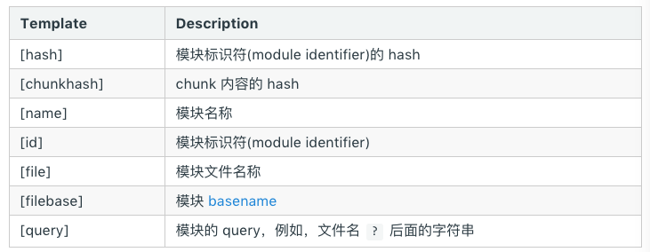

## webpack
>
*webpack* 是一个现代 *JavaScript* 应用程序的模块打包器(module bundler)。当 *webpack* 处理应用程序时，它会递归地构建一个依赖关系图(dependency graph)，其中包含应用程序需要的每个模块，然后将所有这些模块打包成bundle

*webpack* 四个核心概念：**入口(entry)**、**输出(output)**、**loader**、**插件(plugins)**。

### 入口（Entry Points）
#### 单入口
`用法`:`entry: string|Array<string>`

```
const config = {
  entry: './path/to/my/entry/file.js'
};

module.exports = config;
```

`entry` 属性的单个入口语法，是下面的简写

```
const config = {
  entry: {
    main: './path/to/my/entry/file.js'
  }
};
```
>
>向 `entry` 属性传入「文件路径(file path)数组」将创建“多个主入口(multi-main entry)”。在你想要多个依赖文件一起打包，并且将它们的依赖导向(graph)到一个“chunk”时，传入数组的方式就很有用。

#### 多入口
`用法`：`entry: {[entryChunkName: string]: string|Array<string>}`


```
const config = {
  entry: {
    app: './src/app.js',
    vendors: './src/vendors.js'
  }
};
```
多入口一般常用于 分离应用程序(app)和第三方库(vendor)入口、多页面应用程序等情况

```
const config = {
  entry: {
    pageOne: './src/pageOne/index.js',
    pageTwo: './src/pageTwo/index.js',
    pageThree: './src/pageThree/index.js'
  }
};
```

### 出口（output）

`output` 是一个对象，至少要设置以下2个属性：

* `filename` 用于输出文件的文件名。

* `path`目标输出目录 path 的绝对路径。

```
const config = {
  output: {
    filename: 'bundle.js',
    path: '/home/project/dist'
  }
};

module.exports = config;
```
使用node的path模块


```
const path = require('path')
const config = {
  output: {
    filename: 'bundle.js',
    path: path.resolve(__dirname, './dist')
  }
};

module.exports = config;
```

如果配置创建了多个入口，则应该使用占位符(substitutions)来确保每个文件具有唯一的名称。

```
{
  entry: {
    app: './src/app.js',
    search: './src/search.js'
  },
  output: {
    filename: '[name].js',
    path: __dirname + '/dist'
  }
}

// 写入到硬盘：./dist/app.js, ./dist/search.js
```

内置占位符列表




`[hash]` 和 `[chunkhash]` 的长度可以使用 `[hash:8]`（默认为20）来指定

### Loader

`loader` 用于对模块的源代码进行转换。`loader` 可以使你在 import 或"加载"模块时预处理文件。

使用loader要先安装对应的loader模块，例如使用 `webpack` 加载 CSS 文件，或者将 TypeScript 转为 JavaScript

```
npm install --save-dev css-loader
npm install --save-dev ts-loader
```

然后指示 webpack 对每个 .css 使用 css-loader，以及对所有 .ts 文件使用 ts-loader：

```
module.exports = {
  module: {
    rules: [
      { test: /\.css$/, use: 'css-loader' },
      { test: /\.ts$/, use: 'ts-loader' }
    ]
  }
};
```


**配置[Configuration]**

```
module: {
    rules: [
      {
        test: /\.css$/,
        include: [
          path.resolve(__dirname, "css")
        ],
        exclude: [
          path.resolve(__dirname, "node_modules"),
        ],
        // 这里是匹配条件，每个选项都接收一个正则表达式或字符串
        // test 和 include 具有相同的作用，都是必须匹配选项
        // exclude 是必不匹配选项（优先于 test 和 include）
        // 最佳实践：
        // - 只在 test 和 文件名匹配 中使用正则表达式
        // - 在 include 和 exclude 中使用绝对路径数组
        // - 尽量避免 exclude，更倾向于使用 include
        
        use: [
         // 应用多个 loader 和选项
          { loader: 'style-loader' },
          {
            loader: 'css-loader',
            options: {
              modules: true
            }
          }
        ]
      },
      
    ]
  }
```

[loaders传送门](https://webpack.js.org/loaders/)

### 插件(Plugins)
插件目的在于解决 `loader` 无法解决的事

`webpack` 插件是一个具有 `apply` 属性的 `JavaScript` 对象。`apply` 属性会被 `webpack` `compiler` 调用，并且 `compiler` 对象可在整个编译生命周期访问。

```
function ConsoleLogOnBuildWebpackPlugin() {

};

ConsoleLogOnBuildWebpackPlugin.prototype.apply = function(compiler) {
  compiler.plugin('run', function(compiler, callback) {
    console.log("webpack 构建过程开始！！！");

    callback();
  });
};
```

由于插件可以携带参数/选项，你必须在 webpack 配置中，向 plugins 属性传入 new 实例。

根据你的 webpack 用法，可以使用各种不同的插件

```
const HtmlWebpackPlugin = require('html-webpack-plugin'); //通过 npm 安装
const webpack = require('webpack'); //访问内置的插件
const path = require('path');

const config = {
  entry: './path/to/my/entry/file.js',
  output: {
    filename: 'my-first-webpack.bundle.js',
    path: path.resolve(__dirname, 'dist')
  },
  module: {
    loaders: [
      {
        test: /\.(js|jsx)$/,
        use: 'babel-loader'
      }
    ]
  },
  plugins: [
    new webpack.optimize.UglifyJsPlugin(),
    new HtmlWebpackPlugin({template: './src/index.html'})
  ]
};

module.exports = config;
```

[plugins传送门](https://webpack.js.org/plugins/)

